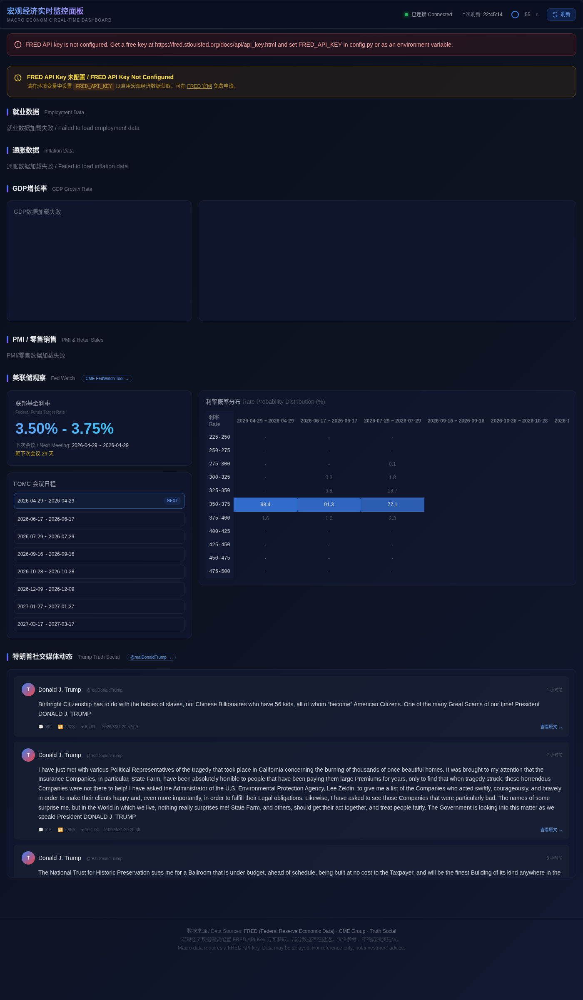

# Macroeconomic Real-Time Dashboard

A self-hosted, real-time macroeconomic monitoring dashboard built with Python/Flask. Tracks U.S. economic indicators, Fed policy expectations, and presidential social media — all in one Bloomberg-terminal-inspired dark UI.



## Features

- **Employment Data** — Nonfarm Payrolls (MoM change), Unemployment Rate, Initial Jobless Claims
- **Inflation Data** — CPI, Core CPI, PCE, Core PCE, PPI (all computed as YoY % change from raw index levels)
- **GDP** — Real GDP Growth Rate with historical bar chart
- **PMI & Retail Sales** — ISM Manufacturing/Services PMI, Michigan Consumer Sentiment, Advance Retail Sales (MoM %)
- **Housing** — Housing Starts, Building Permits, New/Existing Home Sales
- **Fed Watch** — Current Federal Funds Rate, FOMC meeting calendar, countdown to next meeting, rate probability heatmap from CME FedWatch
- **Trump Truth Social** — Latest posts with timestamps and engagement metrics (replies, reblogs, favorites)
- **Auto-refresh** — Background scheduler fetches new data on configurable intervals; frontend polls every 60 seconds
- **Sparkline charts** — Inline trend charts for each indicator via ECharts
- **Bilingual UI** — Chinese primary labels with English secondary labels

## Tech Stack

| Layer | Technology |
|-------|-----------|
| Backend | Python 3.10+, Flask |
| Frontend | Jinja2, TailwindCSS (CDN), ECharts |
| Data Sources | FRED API, CME FedWatch, Truth Social (Mastodon API) |
| Scheduling | APScheduler (background intervals) |
| Caching | cachetools (thread-safe TTL caches) |

## Quick Start

### 1. Clone and install

```bash
git clone https://github.com/YOUR_USERNAME/macro-dashboard.git
cd macro-dashboard
pip install -r requirements.txt
```

### 2. Configure your FRED API key

The dashboard requires a free FRED API key for macroeconomic data.

Get one at: https://fred.stlouisfed.org/docs/api/api_key.html

Then set it via environment variable:

```bash
export FRED_API_KEY=your_key_here
```

Or edit `config.py` directly:

```python
FRED_API_KEY = "your_key_here"
```

### 3. Run

```bash
python app.py
```

Open http://localhost:5050 in your browser.

## Configuration

All settings are in `config.py`:

| Setting | Default | Description |
|---------|---------|-------------|
| `FRED_API_KEY` | `YOUR_FRED_API_KEY_HERE` | Your FRED API key (or set via env var) |
| `FLASK_PORT` | `5050` | Server port (or set `FLASK_PORT` env var) |
| `REFRESH_INTERVALS["macro"]` | `900` (15 min) | How often to refresh FRED data |
| `REFRESH_INTERVALS["fedwatch"]` | `1800` (30 min) | How often to refresh FedWatch data |
| `REFRESH_INTERVALS["truthsocial"]` | `300` (5 min) | How often to refresh Truth Social posts |

### FRED Series

The dashboard tracks 17 economic indicators organized by category. Each series has a display mode that controls how the headline value is derived from raw FRED data:

| Mode | Description | Used by |
|------|-------------|---------|
| `raw` | Show value as-is | Unemployment Rate, PMI, GDP |
| `yoy_pct` | Year-over-year % change | CPI, PCE, PPI (price indices) |
| `mom_diff` | Month-over-month absolute change | Nonfarm Payrolls |
| `mom_pct` | Month-over-month % change | Retail Sales |

To add or remove indicators, edit the `FRED_SERIES` dict in `config.py`.

## API Endpoints

| Endpoint | Description |
|----------|-------------|
| `GET /` | Dashboard UI |
| `GET /api/macro` | All macroeconomic indicators (JSON) |
| `GET /api/fedwatch` | Fed rate, FOMC calendar, rate probabilities (JSON) |
| `GET /api/truthsocial` | Latest Truth Social posts (JSON) |
| `GET /api/status` | Data source health and last fetch times (JSON) |

## Data Source Details

### FRED (Federal Reserve Economic Data)

Requires a free API key. Fetches 17 series across employment, inflation, GDP, PMI/retail, and housing categories. Historical data (up to 24 observations) is used to compute YoY and MoM changes.

### CME FedWatch

Rate probabilities are fetched via multiple fallback approaches:

1. **CME JSON API** — works from residential IPs
2. **Playwright browser** — optional headless browser scraping
3. **Cached snapshot** — pre-fetched JSON in `cache/fedwatch.json`

CME blocks most cloud/VPN IPs. When running locally on a residential connection, approach 1 typically works. The cached snapshot ensures data is always available.

### Truth Social

Posts are fetched via Truth Social's Mastodon-compatible API:

1. **Mastodon API** — `GET /api/v1/accounts/{id}/statuses`
2. **RSS feed** — `/@realDonaldTrump.rss`
3. **Playwright browser** — optional headless browser fallback
4. **Cached snapshot** — pre-fetched JSON in `cache/truthsocial.json`

Like CME, Truth Social blocks most cloud IPs. The cached fallback ensures posts are always displayed.

### Optional: Playwright for blocked IPs

If the direct API approaches fail and you want live data instead of cached snapshots:

```bash
pip install playwright
playwright install chromium
```

Playwright attempts browser-based scraping as a middle fallback before using cached data.

## Project Structure

```
macro-dashboard/
├── app.py              # Flask app, routes, data normalization
├── config.py           # All configuration (API keys, series, intervals)
├── data_fetchers.py    # FREDFetcher, FedWatchFetcher, TruthSocialFetcher, DataCache
├── requirements.txt    # Python dependencies
├── cache/
│   ├── fedwatch.json       # Cached FedWatch rate probabilities
│   └── truthsocial.json    # Cached Truth Social posts
└── templates/
    └── index.html      # Dashboard frontend (Tailwind + ECharts)
```

## Updating Cached Data

The `cache/` directory contains JSON snapshots used as fallback when live APIs are unreachable. To update them:

1. Run the dashboard from a residential IP where both CME and Truth Social are accessible
2. Hit the API endpoints and save the responses:

```bash
curl http://localhost:5050/api/fedwatch > cache/fedwatch.json
curl http://localhost:5050/api/truthsocial > cache/truthsocial.json
```

Or simply let the dashboard run — it will automatically use live data when available and fall back to cache when not.

## License

MIT
