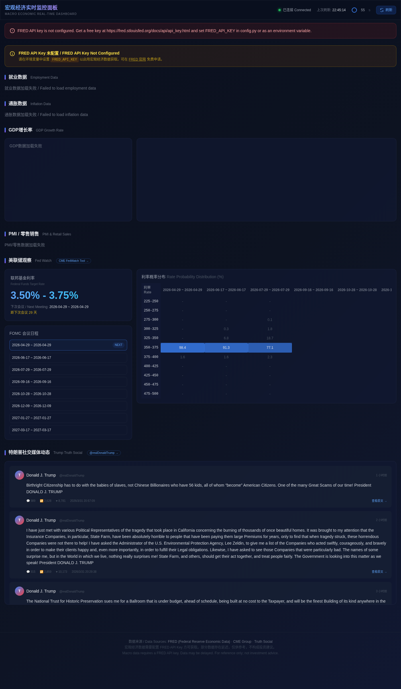

# Macroeconomic Real-Time Dashboard

A self-hosted, real-time macroeconomic monitoring dashboard built with Python/Flask. Tracks U.S. economic indicators, Fed policy expectations, and presidential social media — all in one Bloomberg-terminal-inspired dark UI.



## Features

- **Employment Data** — Nonfarm Payrolls (MoM change), Unemployment Rate, Initial Jobless Claims
- **Inflation Data** — CPI, Core CPI, PCE, Core PCE, PPI (all computed as YoY % change from raw index levels)
- **GDP** — Real GDP Growth Rate with historical bar chart
- **PMI & Retail Sales** — ISM Manufacturing/Services PMI, Michigan Consumer Sentiment, Advance Retail Sales (MoM %)
- **Housing** — Housing Starts, Building Permits, New/Existing Home Sales
- **Fed Watch** — Current Federal Funds Rate, FOMC meeting calendar, countdown to next meeting, rate probability heatmap from CME FedWatch
- **Credit Monitor** — AI-cycle credit risk early warning: IG/HY/BBB OAS spreads (FRED), LQD/HYG proxies, delta/acceleration signals, config-driven WARN/ALERT thresholds incl. a credit-vs-QQQ "2007-style divergence" flag
- **Memory Spot Prices** — storage-cycle tracker: DXI index, DDR5 16Gb, NAND TLC wafer spot prices scraped from DRAMeXchange, with weekly/monthly momentum and rollover (cycle-top) warnings
- **Trump Truth Social** — Latest posts with timestamps and engagement metrics (replies, reblogs, favorites)
- **Auto-refresh** — Background scheduler fetches new data on configurable intervals; frontend polls every 60 seconds
- **Sparkline charts** — Inline trend charts for each indicator via ECharts
- **Bilingual UI** — Chinese primary labels with English secondary labels

## Tech Stack

| Layer | Technology |
|-------|-----------|
| Backend | Python 3.10+, Flask |
| Frontend | Jinja2, TailwindCSS (CDN), ECharts |
| Data Sources | FRED API, CME FedWatch, Truth Social (Mastodon API) |
| Scheduling | APScheduler (background intervals) |
| Caching | cachetools (thread-safe TTL caches) |

## Quick Start

### 1. Clone and install

```bash
git clone https://github.com/YOUR_USERNAME/macro-dashboard.git
cd macro-dashboard
pip install -r requirements.txt
```

### 2. Configure your FRED API key

The dashboard requires a free FRED API key for macroeconomic data.

Get one at: https://fred.stlouisfed.org/docs/api/api_key.html

Then set it via environment variable:

```bash
export FRED_API_KEY=your_key_here
```

Or edit `config.py` directly:

```python
FRED_API_KEY = "your_key_here"
```

### 3. Run

```bash
python app.py
```

Open http://localhost:5050 in your browser.

## Configuration

All settings are in `config.py`:

| Setting | Default | Description |
|---------|---------|-------------|
| `FRED_API_KEY` | `YOUR_FRED_API_KEY_HERE` | Your FRED API key (or set via env var) |
| `FLASK_PORT` | `5050` | Server port (or set `FLASK_PORT` env var) |
| `REFRESH_INTERVALS["macro"]` | `900` (15 min) | How often to refresh FRED data |
| `REFRESH_INTERVALS["fedwatch"]` | `1800` (30 min) | How often to refresh FedWatch data |
| `REFRESH_INTERVALS["truthsocial"]` | `300` (5 min) | How often to refresh Truth Social posts |

### FRED Series

The dashboard tracks 17 economic indicators organized by category. Each series has a display mode that controls how the headline value is derived from raw FRED data:

| Mode | Description | Used by |
|------|-------------|---------|
| `raw` | Show value as-is | Unemployment Rate, PMI, GDP |
| `yoy_pct` | Year-over-year % change | CPI, PCE, PPI (price indices) |
| `mom_diff` | Month-over-month absolute change | Nonfarm Payrolls |
| `mom_pct` | Month-over-month % change | Retail Sales |

To add or remove indicators, edit the `FRED_SERIES` dict in `config.py`.

## API Endpoints

| Endpoint | Description |
|----------|-------------|
| `GET /` | Dashboard UI |
| `GET /api/macro` | All macroeconomic indicators (JSON) |
| `GET /api/fedwatch` | Fed rate, FOMC calendar, rate probabilities (JSON) |
| `GET /api/truthsocial` | Latest Truth Social posts (JSON) |
| `GET /api/credit` | Credit monitor snapshot: series, signals, alerts, CDS readings (JSON) |
| `GET /api/memory` | Memory spot price snapshot: series, momentum signals, alerts (JSON) |
| `GET /api/status` | Data source health and last fetch times (JSON) |

## Data Source Details

### FRED (Federal Reserve Economic Data)

Requires a free API key. Fetches 17 series across employment, inflation, GDP, PMI/retail, and housing categories. Historical data (up to 24 observations) is used to compute YoY and MoM changes.

### CME FedWatch

Rate probabilities are fetched via multiple fallback approaches:

1. **CME JSON API** — works from residential IPs
2. **Playwright browser** — optional headless browser scraping
3. **Cached snapshot** — pre-fetched JSON in `cache/fedwatch.json`

CME blocks most cloud/VPN IPs. When running locally on a residential connection, approach 1 typically works. The cached snapshot ensures data is always available.

### Truth Social

Posts are fetched via Truth Social's Mastodon-compatible API:

1. **Mastodon API** — `GET /api/v1/accounts/{id}/statuses`
2. **RSS feed** — `/@realDonaldTrump.rss`
3. **Playwright browser** — optional headless browser fallback
4. **Cached snapshot** — pre-fetched JSON in `cache/truthsocial.json`

Like CME, Truth Social blocks most cloud IPs. The cached fallback ensures posts are always displayed.

### Credit Risk Monitor (AI-cycle early warning)

Thesis: credit markets reprice risk before equity markets do. The monitor tracks credit spreads as an early-warning signal for stress in AI infrastructure debt.

**Data sources** (each degrades independently — a dead source never crashes the section, it falls back to stored history with a "stale data as of {date}" note):

1. **FRED OAS series** (uses the same `FRED_API_KEY` as the macro section — register free at https://fred.stlouisfed.org/docs/api/api_key.html): `BAMLC0A0CM` (IG Corp OAS), `BAMLH0A0HYM2` (HY OAS), `BAMLC0A4CBBB` (BBB OAS). FRED publishes T+1; ~2 years of history is backfilled on first run so deltas work immediately.
2. **ETF proxies** — daily closes for LQD and HYG (plus QQQ as the equity benchmark) via the Yahoo Finance chart API with a Stooq CSV fallback. No API key needed.
3. **Single-name CDS (NVDA/ORCL/GOOGL/META/AMZN 5Y)** — there is no free CDS API, and this repo has no general news-search capability, so **automated news scraping of CDS quotes is not implemented**. The storage schema, sanity checks (5–2000bp), and alert logic for CDS observations are in place and unit-tested; readings can be added programmatically with source attribution:

   ```python
   from credit_monitor import CreditHistoryStore
   store = CreditHistoryStore()
   store.append_cds_observation("NVDA", 62.0, "2026-08-05", "https://source-article-url")
   store.save()
   ```

**Storage**: append-only JSON at `cache/credit_history.json`, keyed by series → date (existing observations are never overwritten). The file is gitignored — it is a growing local data store, not a committed snapshot.

**Signals** per series: current level, Δ1d / Δ1w / Δ1m (bp for spreads, % for ETFs), and an acceleration flag (is this week's risk move faster than last week's — first derivative over level). Windows are measured in trading days, so market holidays don't skew deltas.

**Tuning thresholds** — all alert logic is config-driven via `CREDIT_ALERT_THRESHOLDS` in `config.py`:

| Key | Default | Meaning |
|-----|---------|---------|
| `spread_widening_bp` | BBB: 20, HY: 50 | WARN if the series widens more than this (bp) within `window_trading_days` |
| `window_trading_days` | 5 | Rolling window for widening checks |
| `cds_level_bp` | NVDA: 100, ORCL: 250 | WARN if a single-name CDS reading exceeds this level |
| `cds_1d_widening_bp` | 15 | WARN if any single name widens more than this vs its prior reading (≤3 days apart) |
| `divergence_equity_flat_pct` | 0.0 | Spread WARN escalates to ALERT ("2007-style divergence") when QQQ's return over the same window is ≥ this |
| `stale_after_days` | 5 | Observations older than this are flagged "stale data as of {date}" (absorbs FRED's T+1 lag + weekends/holidays) |

**Run standalone** (prints the compact digest section without starting the server):

```bash
python credit_monitor.py
```

**Tests** (fixture-driven, covering deltas, acceleration, thresholds, and the divergence case):

```bash
python -m unittest discover tests
```

### Memory Spot Price Monitor (storage-cycle tracker)

Tracks DRAM/NAND spot prices as a daily thermometer for the memory cycle. Spot prices lead contract prices at inflections, so the monitor watches **momentum** (weekly change and whether it is accelerating or rolling over), not levels. Caveats worth remembering: the spot market is a small slice of total volume, HBM has no spot market at all, and the cycle-top *confirmation* is contract-price deceleration plus vendor inventory build — spot rolling over is the early warning, not the verdict.

**Series** (configured in `MEMORY_SERIES` in `config.py`): DXI index, DDR5 16Gb 4800/5600, NAND 512Gb/256Gb TLC wafers, and legacy 2Gb SLC. All scraped from [dramexchange.com](https://www.dramexchange.com/) (session-average spot; no API key, and DRAMeXchange does not block cloud IPs).

**Storage**: append-only JSON at `cache/memory_history.json`, **committed to git** — unlike the credit history there is no backfill API, so history only survives ephemeral cloud disks if the repo carries it. The `scripts/refresh_snapshots.py` job appends the day's prices and pushes on change. Manual point-in-time entries (e.g. from published price reports):

```bash
python memory_monitor.py add DDR5_16G 51.60 2026-08-07
```

**Signals**: Δ1w / Δ1m / Δ3m over calendar windows (sparse-data-safe: a delta is only reported if a base observation exists within 2× the window), plus `accelerating` (weekly gains speeding up) and `rolling_over` (down on the week while still up on the month — the earliest cycle-top pattern).

**Alerts** (tune in `MEMORY_ALERT_THRESHOLDS` in `config.py`): WARN when a series falls more than `weekly_drop_pct` (default −2%) in a week, or when the weekly change turns negative while the monthly change is still above `rollover_monthly_min_pct` (default +2%) — a fresh rollover.

**Run standalone**: `python memory_monitor.py` scrapes once and prints the compact digest.

### Optional: Playwright for blocked IPs

If the direct API approaches fail and you want live data instead of cached snapshots:

```bash
pip install playwright
playwright install chromium
```

Playwright attempts browser-based scraping as a middle fallback before using cached data.

## Project Structure

```
macro-dashboard/
├── app.py              # Flask app, routes, data normalization
├── config.py           # All configuration (API keys, series, intervals, alert thresholds)
├── data_fetchers.py    # FREDFetcher, FedWatchFetcher, TruthSocialFetcher, DataCache
├── credit_monitor.py   # Credit risk monitor: fetchers, signals, alerts, digest
├── requirements.txt    # Python dependencies
├── cache/
│   ├── fedwatch.json          # Cached FedWatch rate probabilities
│   ├── truthsocial.json       # Cached Truth Social posts
│   └── credit_history.json    # Append-only credit observations (gitignored, created on first run)
├── tests/
│   └── test_credit_monitor.py # Delta/alert/divergence unit tests
└── templates/
    └── index.html      # Dashboard frontend (Tailwind + ECharts)
```

## Updating Cached Data

The `cache/` directory contains JSON snapshots used as fallback when live APIs are unreachable. To update them:

1. Run the dashboard from a residential IP where both CME and Truth Social are accessible
2. Hit the API endpoints and save the responses:

```bash
curl http://localhost:5050/api/fedwatch > cache/fedwatch.json
curl http://localhost:5050/api/truthsocial > cache/truthsocial.json
```

Or simply let the dashboard run — it will automatically use live data when available and fall back to cache when not.

### Automated snapshot refresh (for cloud deployments)

Cloud IPs are blocked by Truth Social and CME, so a cloud deployment shows the committed snapshots. To keep them fresh automatically, run the refresher on a home machine (residential IP) — it fetches both sources live, writes the snapshots, and commits + pushes **only when a live fetch succeeded and the content changed**. If your cloud host auto-deploys on push (e.g. a Cloud Build trigger), the deployed site then lags the real feeds by at most an hour.

macOS one-time install (an hourly [launchd](https://support.apple.com/guide/terminal/script-management-with-launchd-apdc6c1077b-5d5d-4d35-9c19-60f2397b2369/mac) job):

```bash
git push          # once, so Keychain stores credentials for non-interactive pushes
bash scripts/install_mac_refresh.sh
launchctl start com.macrodashboard.refresh   # optional: run immediately
tail -f ~/Library/Logs/macrodashboard-refresh.log
```

Notes:

- The job pushes to **whatever branch the local clone has checked out** — make sure it matches the branch your cloud trigger deploys.
- The Mac must be awake for the job to fire (launchd catches up after wake, but not while sleeping). For an always-fresh feed, keep it plugged in with sleep disabled, or run the equivalent cron line (printed by the installer) on any always-on Linux box.
- Manual one-shot run: `python3 scripts/refresh_snapshots.py --push`
- Uninstall: `launchctl unload ~/Library/LaunchAgents/com.macrodashboard.refresh.plist && rm ~/Library/LaunchAgents/com.macrodashboard.refresh.plist`

## License

MIT
